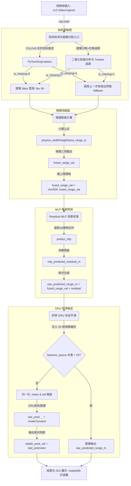

# 实时测距运行链路调用图 (Call Graph)

以下为 `distance_model_gui.py` 内部数据管道的真实调用拓扑关系：

### 核心节点文件、函数与变量映射表

| 数据阶段 | 关联文件 | 关联类/函数 | 核心变量 |
| :--- | :--- | :--- | :--- |
| 视频帧读取 | `distance_model_gui.py` | `process_worker` | `cap = cv2.VideoCapture()` |
| 目标检测 / 分割 | `distance_model_gui.py` | `PyTorchImpl.detect` 或 `cv2.findContours` | `detector_mode`, `contours`, `matched_cand` |
| 包围框生成 | `distance_model_gui.py` | `process_worker` 循环体 | `bw`, `bh`, `area_px`, `last_valid_bbox` |
| 物理距离计算 | `distance_model_gui.py` | `process_worker` 循环体 | `physics_width_range_m`, `fused_range_val` |
| MLP 纠偏推理 | `distance_model_gui.py` | `predict_mlp` | `mlp_predicted_residual_m`, `raw_predicted_range_m` |
| GRU 状态缓存 | `distance_model_gui.py` | `process_worker` 循环体 | `features_queue` (限制最大长度为 25) |
| GRU 预测 | `distance_model_gui.py` | `GRUDistanceStabilizer.forward` | `stable_pred_val` |
| 最终 GUI 展示 | `distance_model_gui.py` | `process_worker` 绘图部分 | `history_fused`, `history_stable`, `chart_canvas` |
