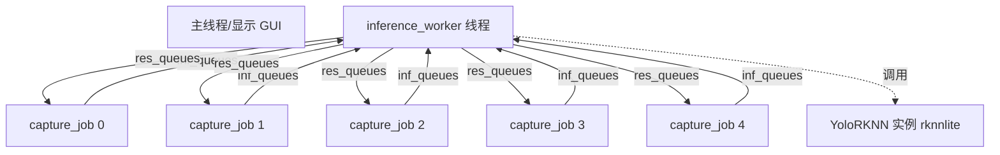
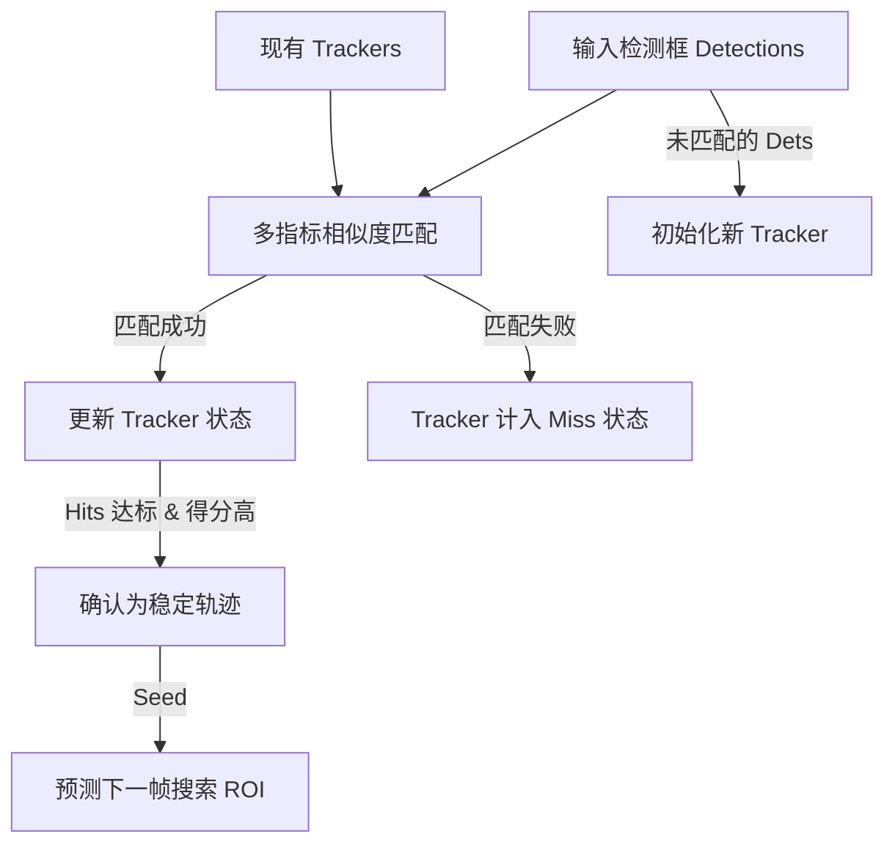

# 无人机 YOLOv5-RKNN 级联侦测追踪系统分析与 RK3588 物理部署迁移方案报告

本报告对当前用于实际部署的 `yolov5_model` 代码库进行了全方位的技术审计与深度剖析，并针对后续“无人机轨迹模型 + YOLOv5 双模型”在 **RK3588** 开发板上的物理部署，提供了一套高并发、低延迟的物理迁移与软硬件加速方案。

---

## 第一部分：当前 YOLOv5-RKNN 系统深度审计与多维度分析

当前系统是一个针对边缘端（RK3588 NPU）优化的 **时空级联运动引导目标检测系统 (Spatio-Temporal Motion-Guided Detection)**。由于在 2560x1440 高清画面中无人机目标极小，且直接对整帧图像进行 YOLOv5 推理在多路流下会造成 NPU 严重超载，系统采用了“低算力运动目标提取（前处理级联） + 关键区域 YOLO 精细识别（后处理确认）”的架构。

### 1. 架构与多线程并发机制

当前系统在 `main.py` 中采用了**一推多收 (One-Inference-Worker, Multi-Capture-Jobs)** 的多线程并行模式：



- **采集与处理线程 (`capture_job`)**：每个摄像头（共 5 路）拥有独立的采集线程，负责以 15 FPS 抓取 `2560x1440` 的 MJPEG 帧。并在线程内完成复杂的帧差、运动特征过滤、轨迹过滤器更新。
- **全局推理线程 (`inference_worker`)**：维护唯一的 `YoloRKNN` 推理器，通过非阻塞轮询 `inf_queues` 消费各路摄像头裁剪出的 `640x640` 融合 ROI，推理完成后将结果投递至对应的 `res_queues`。
- **通信子系统 (`comms.py`)**：
  - `VideoSender`：将检测结果绘制在 640x360 压缩帧上，采用 JPEG 格式通过 UDP 发送至上位机。显式扩展了 `SO_SNDBUF`（2MB），防止大流量 UDP 丢包。
  - `DataSender`：将检测到的无人机坐标和估距信息转换为 JSON 字符串，通过 UDP 发送给云台（Gimbal）。

#### ⚠️ 架构瓶颈分析（CPUs & GIL 限制）
在物理部署到 RK3588 时，由于 Python 的**全局解释器锁（GIL）**限制，虽然使用了 `threading` 启动了 7 个线程（1推理 + 5采集 + 1定时器），但这 7 个线程**无法真正并行利用多核 CPU 算力**。
- `capture_job` 中存在大量 CPU 密集型操作：`cv2.absdiff`、`cv2.resize`、高精度的背景模型计算、轮廓查找及大量的 Python 循环计算（如 LCM 滤波和轨迹匹配）。这会导致单核 CPU 迅速打满，成为系统瓶颈，限制了 NPU 的满载率。

---

### 2. 运动引导级联检测（Motion-Guided Cascade）机制

系统的前处理阶段是其抗噪和过滤虚警的关键，包含了多层手写特征滤波器：

#### A. 帧间差分与静态背景掩膜 (`build_static_bg_model`)
系统为了应对摄像头本身的传感器噪声和微小的环境变化：
1. 首先将输入帧缩放到 `1920x1080`，使用 `cv2.absdiff` 计算与前一帧的差值。
2. 引入了**静态背景方差模型**：在系统初始化的前 5 秒内，采集 60 帧图像计算背景的中位数（Median）作为背景帧 $\mu$，并计算标准差 $\sigma$。生成动态容差门限：
   $$\text{Tolerance} = \text{clip}(\text{LOW\_BG\_ABS\_DELTA} + 3.0 \times \sigma, 14, 255)$$
3. 差分掩膜与背景差分掩膜进行按位与（`cv2.bitwise_and`），大幅降低了风吹树叶、水面波光等静态区域的局部微小扰动。

#### B. LCM 局部对比度滤波器 (`local_contrast_measure`)
这是检测极小目标（如远距离无人机）非常经典的算法。系统计算目标区域与其邻域外环的对比度：
- 计算目标像素均值 $T_{\text{mean}}$，外环背景均值 $B_{\text{mean}}$ 和标准差 $B_{\text{std}}$。
- 计算 LCM 得分与比例：
  $$\text{LCM}_{\text{score}} = \frac{T_{\text{mean}} - B_{\text{mean}}}{\max(B_{\text{std}}, 1.0)}$$
  $$\text{LCM}_{\text{ratio}} = \frac{T_{\text{mean}}}{\max(B_{\text{mean}}, 1.0)}$$
- 若目标得分低于门限（低空模式阈值偏高，防杂波；高空模式偏低，保灵敏度），则直接予以丢弃。

#### C. 多维手写规则噪声抑制
- **灰度质地纹理噪声抑制 (`should_suppress_gray_noise`)**：若目标区域局部灰度方差 $\ge 30$，说明属于云层边缘或杂乱背景纹理，直接滤除；同时支持强光斑（亮面积 $\le 220$，亮度 $\ge 210$）的穿透保留。
- **垂直条带过滤 (`is_vertical_strip_box`)**：无人机在运动成像中很少呈现极端的狭长垂直条带状（如雨滴、下落物体、拉丝噪点），纵横比超过一定阈值（如 $1.6$）的轮廓将被过滤。
- **网格配额均衡器 (`prioritize_diverse_rois`)**：为了防止单路摄像头中某个局部扰动区域（如树枝抖动）产生大量 ROI 占满推理队列，将画面分为 $4 \times 3$ 网格，限制每个网格单元每帧只允许输出 1 个 ROI，确保了检测视角的空间多样性。

---

### 3. 时空轨迹关联与追踪 (`TrajectoryFilter`)

追踪器采用了基于特征级联的卡尔曼风格匹配机制：



- **预测机制**：利用恒定速度模型估计下一帧目标位置：
  $$\text{cx}_{\text{pred}} = \text{cx} + v_x \cdot dt$$
- **动态门限（Dynamic Gate）**：匹配的最大搜索半径结合了运动速度、无人机物理尺寸和失稳次数：
  $$\text{Gate} = \text{max\_dist} + 0.35 \times \text{speed} \times dt + 0.75 \times \text{physical\_motion\_px} + 12.0 \times \text{misses}$$
  能极好地适应无人机转弯、机动导致的预测偏差。
- **多指标匹配得分**：
  $$\text{Score} = 0.42 \times \text{距离得分} + 0.23 \times \text{YOLO置信度} + 0.17 \times \text{模板匹配得分} + 0.18 \times \text{运动一致性得分}$$
  通过融合 OpenCV 的灰度模板匹配（`cv2.matchTemplate`）和运动夹角一致性，使航迹非常稳定。
- **轨迹置信度二次评估 (`_trajectory_score`)**：根据历史航迹中是否包含突变大步长、急折弯（拐角 $\ge 130^\circ$）以及轨迹连续性，对航迹置信度进行二次扣分，剔除了飞鸟、乱飘落叶等无规则杂乱运动。

#### 📐 距离粗略估计公式分析
系统在检测到稳定无人机（确认为稳定轨迹且物理尺寸已知，这里预设宽度 $W_{\text{phys}} = 0.5\text{m}$，水平视场角 $\text{FOV}_h = 17.5^\circ$）时，利用针孔相机模型反投影计算物理距离：
$$\text{fx}_{\text{px}} = \frac{W_{\text{frame}}}{2 \cdot \tan(\text{FOV}_h / 2)}$$
$$\text{Distance} = \frac{W_{\text{phys}} \times \text{fx}_{\text{px}}}{\text{pixel\_width}}$$
这种测距手段简单高效，但高度依赖 $W_{\text{phys}}$ 的准确性。如果实际无人机尺寸为 0.3m 或 1m，测距将成比例倾斜。

---

### 4. RKNN 推理实现 (`yololib.py`)

- **推理核心绑定**：当前代码初始化 RKNN 时，指定了 `core_mask=RKNNLite.NPU_CORE_0_1_2`。这表示推理会调度到 RK3588 的全部 3 个 NPU 核心上，实现单模型的多核轮询或并行。
- **推理通道匹配**：由于 RKNN 模型内部可能被转换为 RGB 通道，而 OpenCV 默认读取 BGR，代码中显式加入了 `cv2.cvtColor(img_in, cv2.COLOR_BGR2RGB)` 的预处理转换（除非环境变量设置了 `YOLO_RKNN_KEEP_BGR`）。
- **多分支兼容解码**：`_branch_pred` 方法非常健壮，支持了 YOLO 各种导出模式的输出排布（包含三层未解码的 Raw Tensor 排布：如 `[1, 3, 6, H, W]`、`[1, 18, H, W]`，以及已解码的 `[25200, 6]` 单大 Tensor 分布），这极大地增强了对不同 ONNX 导出配置的兼容性。

---

## 第二部分：RK3588 物理部署与联合迁移方案

后续任务中，您当前项目中的 **无人机轨迹模型**（假设为深度学习模型，如 LSTM、GRU 或小型的 Transformer，用于预测或姿态研判）需要部署在 RK3588 上，与 YOLOv5 配合工作。以下是完整的迁移路线设计。

### 1. 模型转换与精度调试（ONNX -> RKNN）

轨迹模型和 YOLOv5 模型需利用 x86 电脑上的 `rknn-toolkit2` 工具链转换成 `.rknn` 格式：

```
+------------------+     (x86 PC, RKNN-Toolkit2)     +--------------------+
| 轨迹模型 (ONNX)  | ------------------------------> | 轨迹模型 (.rknn)   |
+------------------+   量化/混精度校准 (convert.py)  +--------------------+

+------------------+                                 +--------------------+
|  YOLOv5 (ONNX)   | ------------------------------> |  YOLOv5 (.rknn)    |
+------------------+                                 +--------------------+
```

#### A. 精度量化控制（FP16 与 INT8 混合量化）
- **YOLOv5 量化**：YOLOv5 的图像检测模型适合转换成 **INT8** 格式。为了降低量化带来的精度损失，必须准备由 200-500 张实际无人机 ROI 图像组成的 `calibration_dataset.txt`，用于量化校准。
- **轨迹模型量化（⚠️ 关键警告）**：
  > [!WARNING]
  > 轨迹模型的输出通常为高精度的连续坐标值或控制量（浮点 regression）。如果将轨迹模型直接量化为 INT8，其权重的微小抖动将导致输出坐标产生严重漂移。
  > **建议**：轨迹模型应采用 **FP16** 精度导出（不使用量化校准）。尽管 FP16 占用的计算资源比 INT8 稍多，但它能完全保留浮点计算精度。RK3588 的 NPU 对 FP16 的算力支持也非常友好。

#### B. 混精度配置示例 (`rknn.config`)
在进行 `rknn.build` 时，可以通过配置文件指定不同算子的精度。例如对轨迹模型的最后一层输出层，显式锁定为 FP16，其余计算量大的中间隐藏层量化为 INT8，从而兼顾性能与精度。

---

### 2. 双模型并发调度与多核 NPU 分配

RK3588 搭载的 NPU 拥有 3 个独立的核（Core 0, Core 1, Core 2），每个核心提供 2.0 TOPS 的算力。若要同时流畅运行 5 路 YOLOv5 + 1 路轨迹模型，需精心进行 NPU 核心绑定（`core_mask`）：

#### 💡 NPU 负载均衡设计方案

```
            +-------------------------------------------+
            |               RK3588 NPU                  |
            +-------------------------------------------+
                 |               |                 |
             [Core 0]        [Core 1]          [Core 2]
                 |               |                 |
            +----------+    +----------+     +------------+
            |  YOLOv5  |    |  YOLOv5  |     |  轨迹模型  |
            | (5路轮询)|    | (5路轮询)|     | (时序更新) |
            +----------+    +----------+     +------------+
```

1. **YOLOv5 推理器**：
   - 实例化两个 `YoloRKNN` 运行时，分别绑定到 `core_mask=RKNNLite.NPU_CORE_0` 和 `RKNNLite.NPU_CORE_1`。
   - 5 路摄像头的输入图像通过一个工作线程池，交替分发给这两个运行在不同物理核心上的推理实例。
2. **轨迹模型推理器**：
   - 实例化一个轨迹模型运行时，绑定到 `core_mask=RKNNLite.NPU_CORE_2`。
   - 这能保证轨迹模型的推理不被频繁涌入的图像检测任务阻塞，确保决策和预测控制链具有确定性的极低延迟（< 5ms）。

---

### 3. 高性能 C++ 重构路线与硬加速（突破 GIL 限制）

若要将 5 路 1440p 的完整级联算法跑满 15 FPS 甚至更高的帧率，使用 **C++** 对整个系统进行重构是唯一的极致优化手段。重构时必须引入瑞芯微官方的底层硬加速组件：

#### A. 核心硬加速库集成
1. **MPP (Media Process Platform) 视频硬解码**：
   - 抛弃 `cv2.VideoCapture` 的软件解码。
   - 使用 **MPP** 直接从 V4L2 摄像头读取并硬件解码 MJPEG/H.264/H.265 视频流。解码后的数据直接存储在 **DRM/DMA-BUF** 物理连续内存中。
2. **RGA (Raster Graphic Acceleration) 图形加速引擎**：
   - 图像的前处理（如 `cv2.resize`、通道转换 `BGR->RGB`、零均值归一化）如果在 CPU 上执行，会导致 RK3588 的 Cortex-A76 核心迅速打满。
   - 必须使用 **RGA** 硬件加速器。RGA 可以直接操作 MPP 解码输出的 DMA-BUF 内存，在硬件级完成缩放和裁剪，耗时通常 < 1ms。
3. **零拷贝（Zero-Copy）推理流**：
   - 数据通过 RGA 预处理后，直接将对应的 DMA-BUF 物理指针传递给 `rknn_inputs_set` 接口。
   - **完全避免了**图像数据在 CPU、GPU、NPU 之间的拷贝过程，CPU 占用率将下降 80% 以上。

#### B. 级联数据流架构（C++）

```
[Camera V4L2] 
      |
      v
[MPP 硬解码] (输出: DMA-BUF 帧)
      |
      +--------------> [RGA 降采样 1080p] -> [C++ 帧差 & 运动特征过滤] (CPU)
      |                                              |
      |                                              v
      |                                        [提取运动 ROI]
      |                                              |
      v                                              v
[RGA 裁剪 640x640] <---------------------------------+ (时空融合)
      |
      v
[YOLOv5 (RKNPU2 Core 0/1)] (零拷贝推理)
      |
      v
[坐标反馈] -> [轨迹模型 (RKNPU2 Core 2)]
```

---

### 4. 物理外设与通信层集成

在硬件物理部署到无人机机载端时，网络与接口的物理层可靠性至关重要：

- **网络缓存调优**：
  在 RK3588 的 Linux 系统中，执行以下命令调优网卡 UDP 缓冲区，防止多路网络视频流瞬间发生丢包：
  ```bash
  sudo sysctl -w net.core.rmem_max=8388608
  sudo sysctl -w net.core.rmem_default=2097152
  ```
- **云台控制实时性（串口迁移）**：
  若当前 `comms.py` 中通过网络向云台发送数据在无线链路中延时高，建议迁移至 RK3588 物理串口（如 `/dev/ttyS3`，通过 RS485 或 TTL-to-RS232）直接与云台控制板对接，保障延迟 < 2ms。
- **轨迹时序对齐**：
  当 YOLOv5 的推理结果产生时，需要带上原始采集帧的**硬件时间戳（Timestamp）**。轨迹模型在接收到坐标时，必须结合这一时间戳进行时序插值更新，防止网络抖动导致的轨迹预测漂移。

---

## 第三部分：迁移实施建议与路线图

| 阶段 | 实施任务 | 核心产出物 | 预期性能/指标 |
| :--- | :--- | :--- | :--- |
| **阶段 1：模型转换** | 在 x86 PC 上，使用 `rknn-toolkit2` 完成 YOLOv5 (INT8) 和轨迹模型 (FP16) 的编译转换。 | `yolov5s.rknn` <br> `trajectory_model.rknn` | 精度损失 < 1.5% |
| **阶段 2：Python 级联重构** | 在 RK3588 上，基于 `rknnlite` 重构推理分配：YOLO (Core 0/1)，轨迹 (Core 2)。将 5 路图像采集升级为 `multiprocessing` 进程池逃离 GIL 限制。 | 优化后的 Python 原型系统 | 5 路图像帧率达到 10~15 FPS |
| **阶段 3：高性能 C++ 迁移** | 编写 C++ 推理框架。引入 **MPP 解码** 和 **RGA 图像缩放处理**。使用 NPU 零拷贝（Zero-Copy）推理。 | C++ 独立部署包 (C++ RKNPU2) | 5 路图像帧率 > 25 FPS <br> CPU 占用 < 30% |
